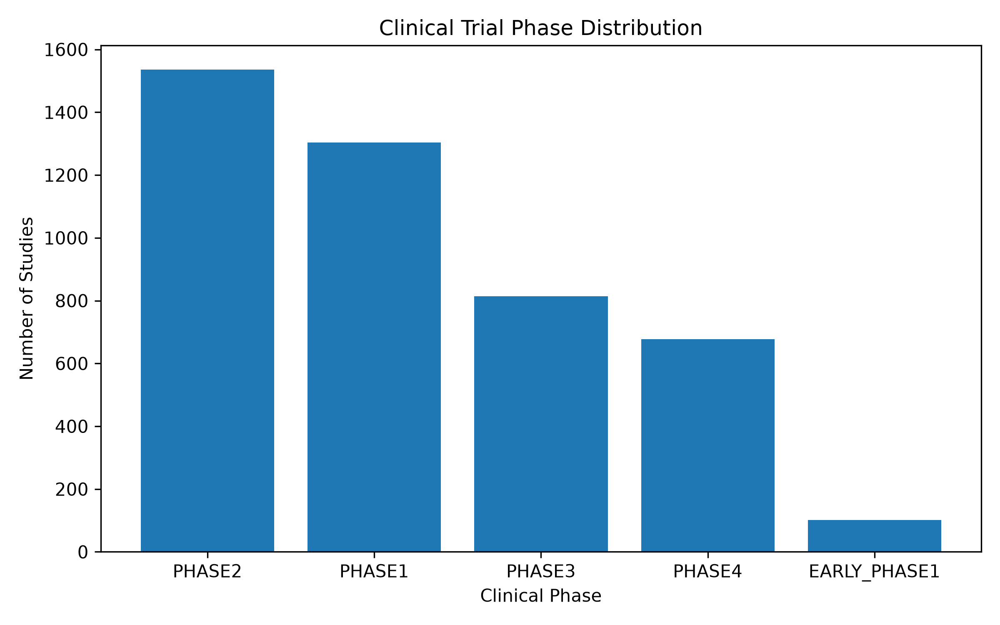
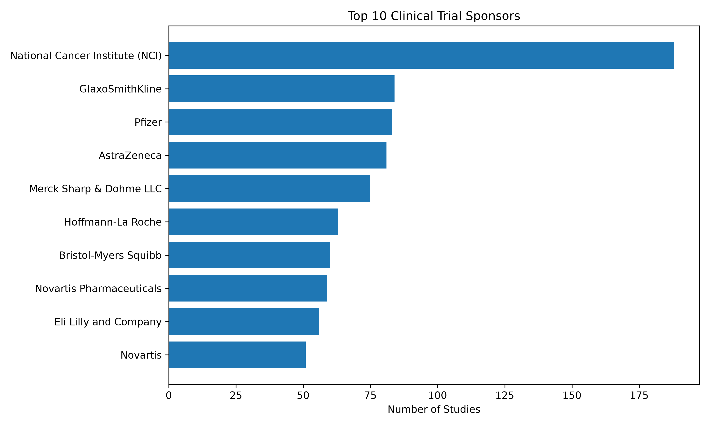
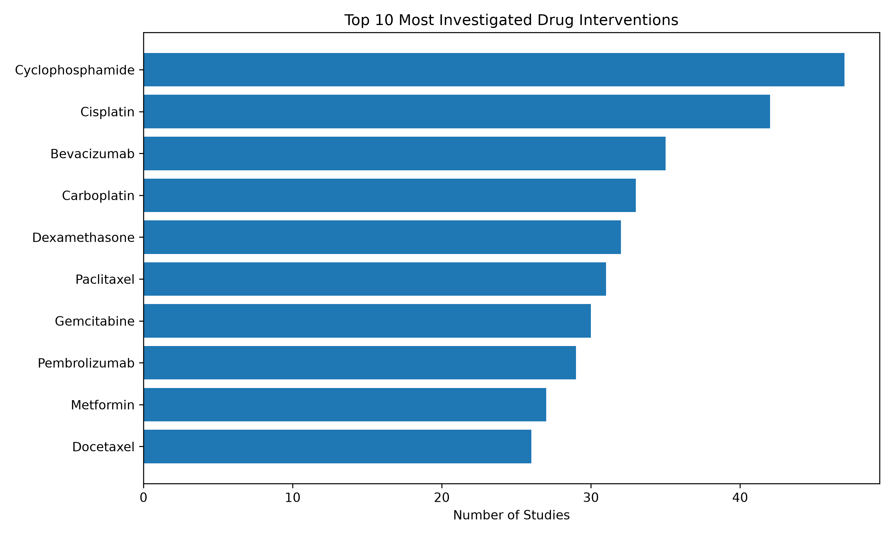

# Drug Development Landscape: Relational Database Analysis of ClinicalTrials.gov Studies

## Overview

This project explores 5,000 clinical studies retrieved from the ClinicalTrials.gov API by building a normalized SQLite relational database and performing SQL-based exploratory analyses.

The workflow includes automated data collection through the ClinicalTrials.gov API, transformation of nested JSON data into structured tables, database normalization, and analytical SQL queries to investigate clinical trial phases, sponsors, therapeutic interventions, and disease indications.

The project demonstrates how relational database design can be applied to biomedical research data to answer complex research questions efficiently while minimizing data redundancy.

---

## Database Schema

The normalized SQLite database consists of eight related tables connected through primary and foreign keys. The schema minimizes data redundancy while enabling flexible SQL queries across studies, sponsors, interventions, conditions, and study locations.

<p align="center">
  
</p>

---

## Objectives

* Retrieve real-world clinical trial data from the ClinicalTrials.gov API.
* Transform nested JSON responses into structured datasets using Python.
* Build a normalized SQLite relational database using primary and foreign keys.
* Apply SQL queries to explore clinical trial characteristics, sponsors, interventions, and disease conditions.
* Demonstrate how relational databases support scalable biomedical data analysis.

---

## Workflow

The project was developed in three stages:

### 1. Data Collection

Clinical trial data were retrieved from the ClinicalTrials.gov API using Python. The nested JSON responses were processed into five structured datasets:

* Studies
* Sponsors
* Interventions
* Conditions
* Locations

### 2. Database Creation

The extracted datasets were transformed into a normalized SQLite relational database.

The final database includes the following tables:

* studies
* sponsors
* study_sponsors
* interventions
* study_interventions
* conditions
* study_conditions
* locations
* study_locations

Relationship tables were used to model many-to-many associations between studies, sponsors, interventions, and disease conditions while reducing data redundancy.

### 3. SQL Analysis

SQL queries were used to explore the clinical trial landscape through descriptive and relational analyses.

---

## Repository Structure

```text
Drug-Development-Landscape/
│
├── data/
├── database/
│   └── drug_development_landscape.db
│
├── figures/
│
├── notebooks/
│   ├── 01_data_collection.ipynb
│   ├── 02_database_creation.ipynb
│   └── 03_sql_analysis.ipynb
│
└── README.md
```

---

## Key Analyses

The SQL analysis addressed several research questions:

* How many clinical studies are included in the database?
* How are studies distributed across clinical development phases?
* How does participant enrollment vary by clinical phase?
* Which organizations sponsor the largest number of clinical studies?
* Which drug interventions are investigated most frequently?
* Which sponsors investigate the widest variety of diseases?
* Which diseases are most frequently investigated with Cyclophosphamide?

---

## Results

### Clinical Phase Distribution



---

### Top Clinical Trial Sponsors



---

### Most Frequently Investigated Drug Interventions



---

## Key Findings

The analysis of 5,000 clinical studies retrieved from ClinicalTrials.gov demonstrated how relational databases can be used to explore complex biomedical datasets through SQL. By organizing the information into normalized tables, it was possible to efficiently connect studies, sponsors, interventions, conditions, and study locations using relational queries.

Clinical trial activity was concentrated in Phase II and Phase I studies, while Phase III trials enrolled substantially larger patient populations on average. This pattern reflects the typical progression of drug development, where early-stage studies focus on safety and dose optimization, whereas later phases evaluate efficacy in larger populations.

The analysis also highlighted the prominent role of both public research organizations and the pharmaceutical industry. The National Cancer Institute (NCI) was the most active sponsor in the dataset, while companies such as Pfizer, AstraZeneca, GlaxoSmithKline, and Hoffmann-La Roche were responsible for a large number of clinical studies across multiple therapeutic areas.

Among active drug interventions, Cyclophosphamide was the most frequently investigated medication, followed by Cisplatin, Bevacizumab, Carboplatin, Dexamethasone, and Pembrolizumab. The predominance of established oncology therapies suggests that cancer research represents a substantial component of the analyzed dataset, while the presence of drugs such as Metformin highlights the diversity of therapeutic areas represented.

Finally, the project demonstrated the value of relational database design for biomedical data analysis. By combining multiple normalized tables through SQL joins and aggregate functions, it was possible to answer complex research questions involving sponsors, diseases, and therapeutic interventions. This workflow illustrates how database normalization enables scalable, flexible, and reproducible clinical research analyses.

---

## Technologies

* Python
* Pandas
* SQLite
* SQL
* ClinicalTrials.gov API
* Matplotlib
* Jupyter Notebook

---

## Future Improvements

Potential extensions of this project include:

* Geographic analysis of clinical trial locations.
* Classification of interventions into therapeutic classes.
* Time-series analysis of clinical trial activity.
* Interactive dashboards using Power BI or Tableau.
* Integration with additional biomedical databases.

---

## Author

Biology undergraduate with interests in Clinical Research, Clinical Data Analytics and Bioinformatics.

GitHub: https://github.com/marialuzacevedo

LinkedIn: https://www.linkedin.com/in/marialuzacevedo 