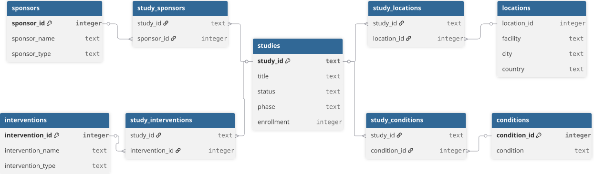
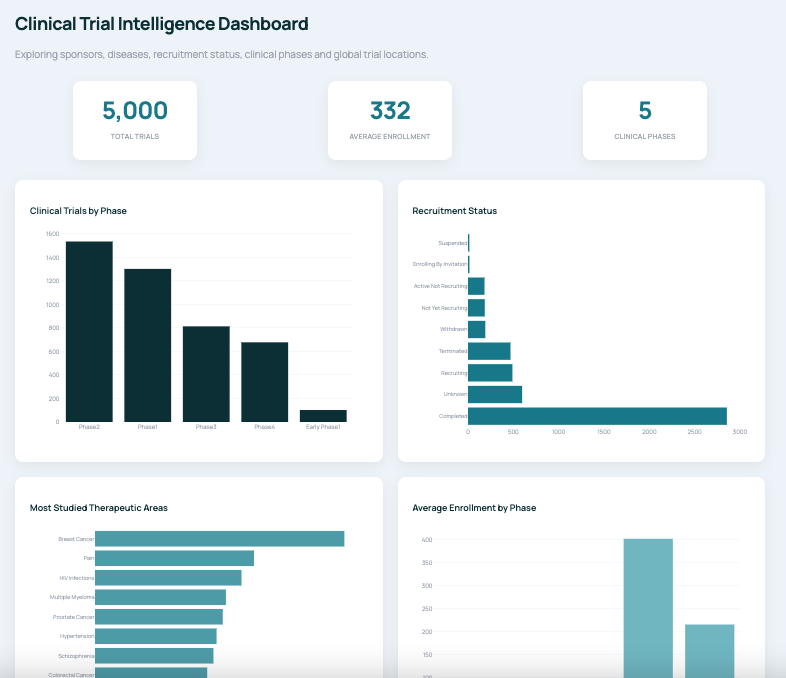

# Drug Development Landscape: Clinical Trial Analytics Platform Using SQL and Python

## Overview

This project explores a subset of 5,000 clinical studies retrieved from the ClinicalTrials.gov API by building a normalized SQLite relational database and performing SQL-based exploratory analyses.

The workflow includes automated data collection through the ClinicalTrials.gov API, transformation of nested JSON data into structured tables, database normalization, and analytical SQL queries to investigate clinical trial phases, sponsors, therapeutic interventions, and disease indications.

The project also includes a clinical trial intelligence dashboard developed with Plotly Dash, providing visual exploration of clinical trial phases, therapeutic areas, sponsors, recruitment status, enrollment patterns, and global study locations.

This demonstrates how relational database design can be applied to biomedical research data to answer complex research questions efficiently while minimizing data redundancy.

---

## Data Source

Clinical trial records were retrieved from the ClinicalTrials.gov API.

The original API response is not included in the repository due to file size limitations. The dataset can be reproduced by running the data collection notebook.

---

## Technologies

* Python
* Pandas
* SQLite
* SQL
* ClinicalTrials.gov API
* Matplotlib
* Jupyter Notebook
* Plotly
* Dash
* SQLAlchemy
* Gunicorn
* Render

---

## Database Schema

The normalized SQLite database consists of nine related tables connected through primary and foreign keys. The schema minimizes data redundancy while enabling flexible SQL queries across studies, sponsors, interventions, conditions, and locations.

<p align="center">
  
</p>

---

## Objectives

* Retrieve real-world clinical trial data from the ClinicalTrials.gov API.
* Transform nested JSON responses into structured datasets using Python.
* Build a normalized SQLite relational database using primary and foreign keys.
* Apply SQL queries to explore clinical trial characteristics, sponsors, interventions, and disease conditions.
* Demonstrate how relational databases support scalable biomedical data analysis.

---

## Workflow

The project was developed in three stages:

### 1. Data Collection

Clinical trial data were retrieved from the ClinicalTrials.gov API using Python. The nested JSON responses were processed into five structured datasets:

* Studies
* Sponsors
* Interventions
* Conditions
* Locations

### 2. Database Creation

The extracted datasets were transformed into a normalized SQLite relational database.

The final database includes the following tables:

* studies
* sponsors
* study_sponsors
* interventions
* study_interventions
* conditions
* study_conditions
* locations
* study_locations

Relationship tables were used to model many-to-many associations between studies, sponsors, interventions, and disease conditions while reducing data redundancy.

### 3. SQL Analysis

SQL queries were used to explore the clinical trial landscape through descriptive and relational analyses.

Examples of queries performed:

- Aggregation of trials by clinical phase.
- Sponsor ranking using JOIN operations.
- Intervention frequency analysis.
- Disease-intervention relationships using many-to-many relationships.

---

## Interactive Dashboard

A web-based clinical trial intelligence dashboard was developed using Plotly Dash to visualize the clinical trial landscape contained in the relational database.

The dashboard integrates SQL-derived metrics and interactive visualizations to explore:

* Clinical trial distribution across development phases.
* Most frequently investigated therapeutic areas.
* Leading clinical trial sponsors.
* Sponsor type distribution.
* Recruitment status patterns.
* Average enrollment by clinical phase.
* Global distribution of clinical trial locations.

The dashboard was built using:

* Python
* Plotly
* Dash
* SQLAlchemy
* SQLite
* Gunicorn
* Render

<p align="center">
  
</p>

Explore the interactive clinical trial analytics dashboard:
[https://drug-development-landscape.onrender.com/]

--- 

## Repository Structure

```text
Drug-Development-Landscape/
│
├── data/
├── database/
│   └── drug_development_landscape.db
│
├── figures/
│
├── notebooks/
│   ├── 01_data_collection.ipynb
│   ├── 02_database_creation.ipynb
│   └── 03_sql_analysis.ipynb
│
└── README.md
```

---

## Key Analyses

The SQL analysis addressed several research questions:

* How many clinical studies are included in the database?
* How are studies distributed across clinical development phases?
* How does participant enrollment vary by clinical phase?
* Which organizations sponsor the largest number of clinical studies?
* Which drug interventions are investigated most frequently?
* Which sponsors investigate the widest variety of diseases?
* Which diseases are most frequently investigated with Cyclophosphamide?

---

## Results

### Clinical Phase Distribution


The distribution of clinical studies was concentrated in Phase II and Phase I trials, reflecting the high volume of early-stage clinical development activities. Phase I studies primarily evaluate safety and dose optimization, while Phase II trials provide preliminary evidence of efficacy and continue safety assessment.

---

### Top Clinical Trial Sponsors


The sponsor analysis revealed a combination of academic institutions, governmental organizations, and pharmaceutical companies as major contributors to clinical research. The National Cancer Institute (NCI) was among the most represented sponsors, highlighting the importance of large-scale oncology research programs, while companies such as Pfizer, AstraZeneca, and GlaxoSmithKline demonstrated substantial involvement in clinical development.

---

### Most Frequently Investigated Drug Interventions


The most frequently investigated interventions included established oncology therapies such as Cyclophosphamide, Cisplatin, Bevacizumab, and Pembrolizumab. The prevalence of these drugs reflects the strong representation of cancer-related studies within the analyzed dataset and illustrates how clinical trial databases capture both emerging therapies and established treatment approaches.

---

## Key Findings

The analysis of 5,000 clinical studies retrieved from ClinicalTrials.gov demonstrated how relational databases can be used to explore complex biomedical datasets through SQL. By organizing the information into normalized tables, it was possible to efficiently connect studies, sponsors, interventions, conditions, and study locations using relational queries.

Clinical trial activity was concentrated in Phase II and Phase I studies, while Phase III trials enrolled substantially larger patient populations on average. This pattern reflects the typical progression of drug development, where early-stage studies focus on safety and dose optimization, whereas later phases evaluate efficacy in larger populations.

The analysis also highlighted the prominent role of both public research organizations and the pharmaceutical industry. The National Cancer Institute (NCI) was the most active sponsor in the dataset, while companies such as Pfizer, AstraZeneca, GlaxoSmithKline, and Hoffmann-La Roche were responsible for a large number of clinical studies across multiple therapeutic areas.

Among active drug interventions, Cyclophosphamide was the most frequently investigated medication, followed by Cisplatin, Bevacizumab, Carboplatin, Dexamethasone, and Pembrolizumab. The predominance of established oncology therapies suggests that cancer research represents a substantial component of the analyzed dataset, while the presence of drugs such as Metformin highlights the diversity of therapeutic areas represented.

Finally, the project demonstrated the value of relational database design for biomedical data analysis. By combining multiple normalized tables through SQL joins and aggregate functions, it was possible to answer complex research questions involving sponsors, diseases, and therapeutic interventions. This workflow illustrates how database normalization enables scalable, flexible, and reproducible clinical data analyses.

---

## Future Improvements

Potential extensions of this project include:


* Automated ETL pipeline for periodic ClinicalTrials.gov updates.
* Therapeutic area classification using NLP.
* Drug-target and indication relationship analysis.
* Machine learning models for clinical trial outcome prediction.
* Integration with additional biomedical databases. 
 
---

## Author

Biology undergraduate building data-driven solutions for biomedical research, clinical trial analysis and pharmaceutical development.

GitHub: https://github.com/marialuzacevedo

LinkedIn: https://www.linkedin.com/in/marialuzacevedo 
